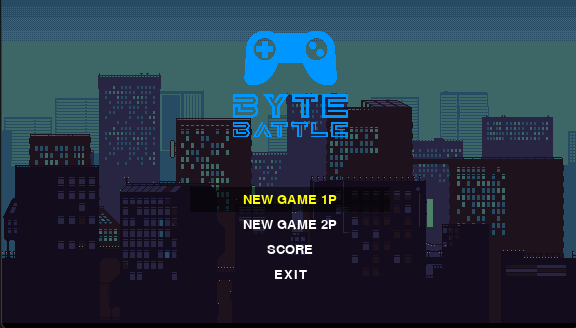
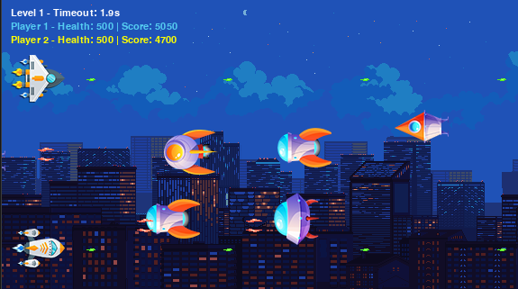

# **Byte Battle** 🚀



**Byte Battle** é um jogo de batalha espacial onde você pilota uma nave e enfrenta hordas de inimigos! São **dois modos de jogo**: **1 Player** e **2 Players**, e você vai precisar de muita habilidade para sobreviver e alcançar a maior pontuação possível.

---

## **Objetivo do Jogo** 🌟

O objetivo principal do **Byte Battle** é **destruir inimigos** enquanto você navega pelo espaço. No modo **1 Player**, você enfrenta ondas de inimigos sozinho, enquanto no modo **2 Player**, você pode desafiar um amigo! Cada inimigo destruído aumenta sua **pontuação**.

### **Como Jogar** 🎮

1. **Escolha seu modo**:
   - **Modo 1P**: Jogue sozinho e defenda o universo!
   - **Modo 2P**: Desafie um amigo para ver quem é o melhor piloto de naves!

2. **Controles**:
   - **Player 1**:
     - **Movimento**: **W, A, S, D**
   
   - **Player 2** (somente no modo 2P):
     - **Movimento**: **Setas do teclado** (cima, baixo, esquerda, direita)

3. **Objetivo**: 
   - Destrua os inimigos e sobreviva o maior tempo possível. Cada inimigo destruído aumenta seu **score**.
   - **Tempo**: Fique de olho no **tempo restante**! Se o tempo acabar ou sua nave for destruída, o jogo termina.

---

## **Como Funciona** 🔧

O jogo utiliza **Pygame** e foi projetado para ser rápido e dinâmico. As principais mecânicas incluem:
- **Movimento das naves** usando teclas de direção.
- **Atirar automaticamente**, com **tiros** que podem destruir inimigos.
- **Contabilização de pontos** com base nos inimigos destruídos.

### **Tela de Score** 🏆

Após o término do nível, a **pontuação** de cada jogador é registrada e salva, mostrando a **maior pontuação** até o momento. O vencedor da fase é aquele que **sobrevive mais tempo** ou destrói mais inimigos. 

---

## **Tecnologias Usadas** ⚙️

- **Pygame**: A biblioteca principal para desenvolvimento de jogos em 2D.
- **SQLite3**: Usado para registrar e salvar os scores dos jogadores.
- **Python**: Linguagem utilizada para desenvolver o código do jogo.

---

## **Como Jogar** (resumo) 🎮

1. Selecione o **modo de jogo** no menu (1P ou 2P).
2. Use as teclas para **mover a nave**.
3. Sobreviva o maior tempo possível ou destrua o maior número de inimigos para obter uma alta pontuação.
4. Após o jogo terminar, **digite seu nome** e veja sua pontuação aparecer na tela de **Score**!

---

### **Gameplay - Durante a Batalha**



---

## **Como Compilar e Rodar o Jogo** ⚡

1. **Instale o Pygame**:
   Se você ainda não tem o **Pygame** instalado, rode:
   ```bash
   pip install pygame

Desenvolvedor: Willer Lucoles

Portfolio: https://willerlucoles.vercel.app/
